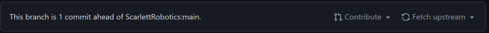

[Back](/readme.md)
# What is Git?
Git is a version control system. It allows you to save snapshots or "commits" of your code. When you make a new commit, the changes you make are saved to disk. At any point in time, you can go back to a previous commit.

## Before we start
Make sure git is installed on your computer. To check if you have git installed, type `git --version` in a terminal/command prompt. If it gives you a version back, you are good to go. If you need to install git, see the [setup page](../setup.md).

## Gettings Started
Before using git, we first need to create a GitHub account. GitHub is a remote repository, allowing multiple users to collaborate on the same project. Create an account on [github.com](https://www.github.com).

## Your assignment
1. Download your Java OOP assignment. This can be done by clicking the three dots beside the root folder in the online ide.

2. Fork the Scarlett Robotics [git-practice](https://GitHub.com/ScarlettRobotics/git-practice) repository. This can be done by clicking the fork button in the top right corner.

3. Clone the repository to your local system. 
> If you're using GitHub desktop, select file > clone repository.

> If you're using git on the command line, use `git clone [your repo url] [location to clone]`. This will look something like `git clone https://GitHub.com/Kappabyte/git-practice C:\Users\avery\dev\git-practice`. You can use an absolute path (as shown) or a relative path to your current directory.
    
> If you are using VSCode's built in git system, click clone repository in the git tab in the sidebar.

4. Create a folder with your name in the local version of the repo. Inside this folder, place your OOP assignment files.

5. Stage and commit your changes.
> If using GitHub desktop, use the textbox at the bottom of the file list to give the commit a detailed message. Click commit.

> If using the command line, add the changed files with `git add .` Your current directory should be the root of the repository. Commit your changes with `git commit -m "message"`. This will look something like: `git commit -m "Added project files"`. Make sure to keep the quotes

> If using VSCode's built in git system, Give the commit a detailed message in the Message box and click the checkmark.

6. Push your changes to GitHub.
> If using GitHub desktop, click the push changes button at the top of the window.

> If using the command line, use `git push`.

> If using VSCode's built in git system, click the three dots, then push.

Congratulations! You made your first git commit. If you go to your repository on GitHub, your files should be there!

## Creating a pull request
Now that you've made changes your repository, lets get those changes on the main scarlett robotics repository.

1. On your repository on GitHub, click contribute:

2. Click open pull request.
3. Click create pull request.
4. Name your pull request
4. Give a description of the changes you made.
5. Wait for your changes to be approved by the repository owner!