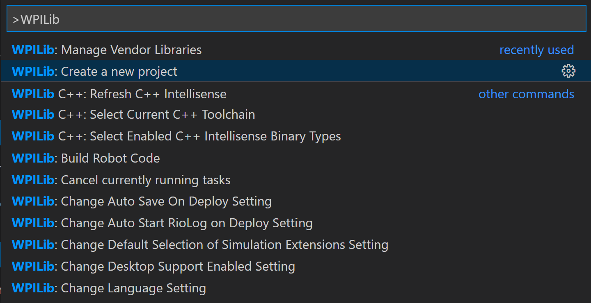
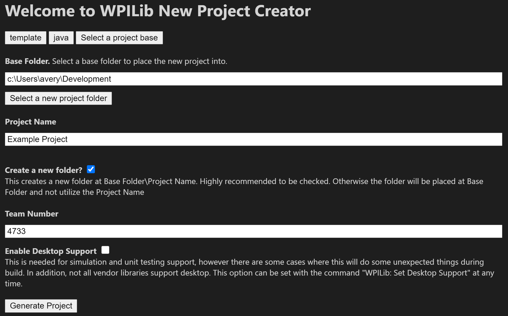

[Back](../readme.md)

# Creating a WPILib Project
In order to write code for the robot, you must first create a project.

1. Open WPILib VSCode
2. Click the WPILib icon in the top right corner.

3. Find Create Project in the dropdown

4. Click `Select A Project Type`
5. Choose `Template`
6. Choose `Java`
7. Choose `Command Robot`
8. Choose the folder to place the project into
9. Give the project a name
10. Enter the team number `4733`

11. Click `Generate Project`