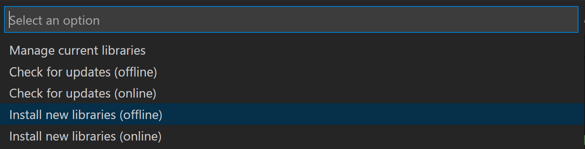

# Third Party Libraries
Some motor controllers or sensors require third party libraries to use. For example, the `VictorSPX` motor controller is a part of the Pheonix software. In order to use it, you must install the Pheonix Framework, which can be found on the [setup page](../setup.md).

## Enabling the Pheonix Library
1. Open WPILib VSCode
2. Click the WPILib icon in the top right corner.

3. Find manage vendor libraries on the list.

4. Choose Install new libraries (offline)
